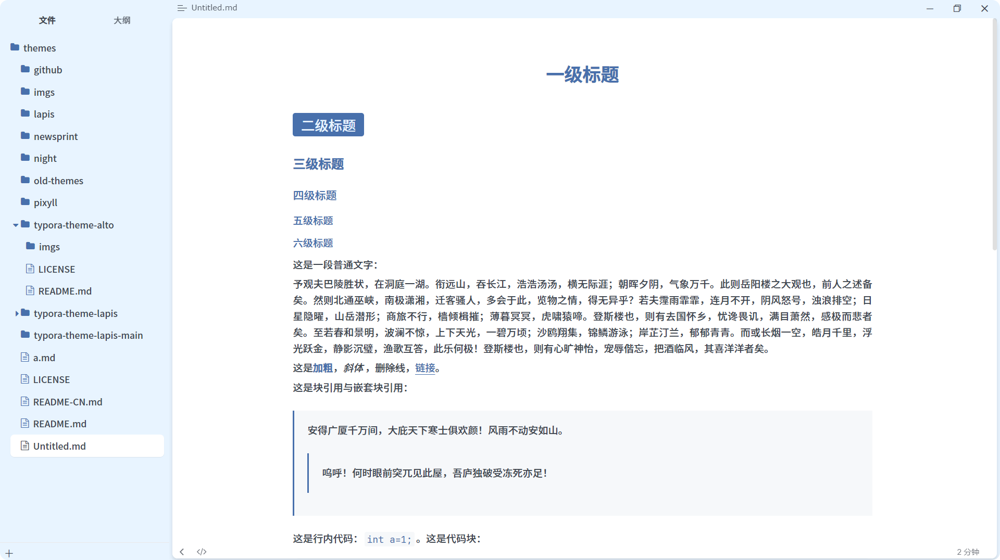
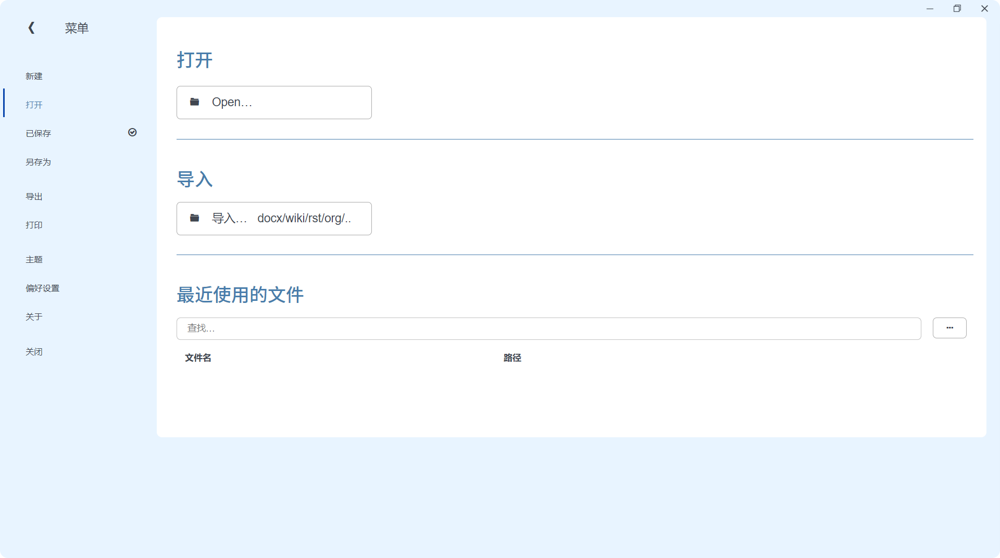
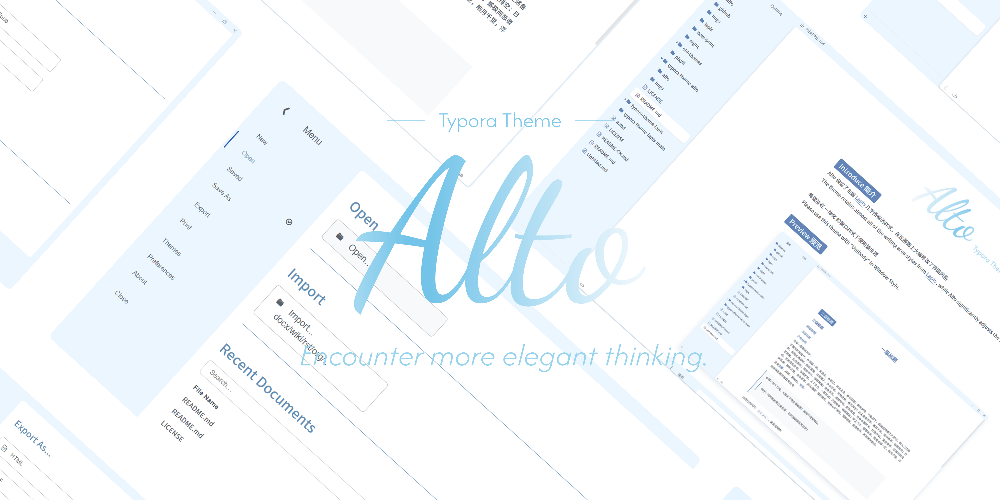

> [!NOTE]
> 目前 Alto v2 暂时以 [Pre-release]((https://github.com/Seeridia/typora-theme-alto/releases)) 的方式发布，目前项目主分支即为 v2-beta
> 如需使用 Alto v1 可以前往 [Releases](https://github.com/Seeridia/typora-theme-alto/releases/latest) 下载

## 简介

**Alto 迎来了第二代！**

Alto 为更现代更优雅的 Typora 界面而生，目前已完全支持 [Lapis](https://github.com/YiNNx/typora-theme-lapis) 以及所有 Typora 内置主题（暂时不含 Dark 模式），其余大部分第三方主题也能得到很好的适配。

请在 “**一体化**” 界面下，使用 Alto

## 预览

## 安装

1. 克隆此仓库或从 [Latest Release](https://github.com/Seeridia/typora-theme-alto/releases/latest) 下载 `typora-theme-alto.zip`。

2. 在 Typora 中，打开“偏好设置”（`文件` > `偏好设置`）。然后切换到外观标签并点击“打开主题文件夹”按钮

3. 将 `alto.css` 文件和 `alto` 文件夹复制到 Typora 的主题文件夹中

4. 在 Typora 中，打开“偏好设置”（`文件` > `偏好设置`）。然后切换到外观标签并点击“单体”按钮

5. 重启 Typora，并从主题菜单中选择 **Alto** 主题

## 致谢

- 主题 [Lapis](https://github.com/YiNNx/typora-theme-lapis) 以及 ta 的作者 [YiNN](https://github.com/YiNNx) 
- 部分界面样式的灵感来源于 [Arc](https://arc.net/) 以及 [Microsoft 365](https://www.microsoft.com/microsoft-365)

## 说明

- 给个 star 呗⭐
- 我只是个刚入学的大一学生，忙着竞赛，如果有什么问题，想更快地被修复，不妨自己改改👍
- 如果你不会，那请开始学吧，以及，我也是刚开始学的，所以会出现很多不成熟的代码，请谅解
- 或许会有制作 Alto 自己完整主题的想法，但现在没什么空……

## 主题支持与颜色

| 主题 | 颜色 |
| --- | --- |
| [Lapis](https://github.com/YiNNx/typora-theme-lapis) | 