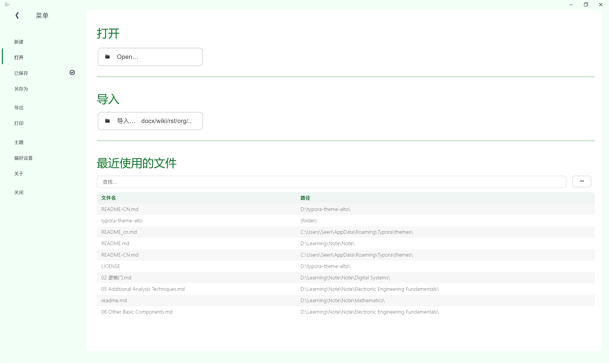
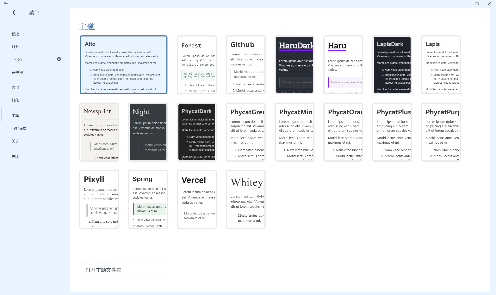
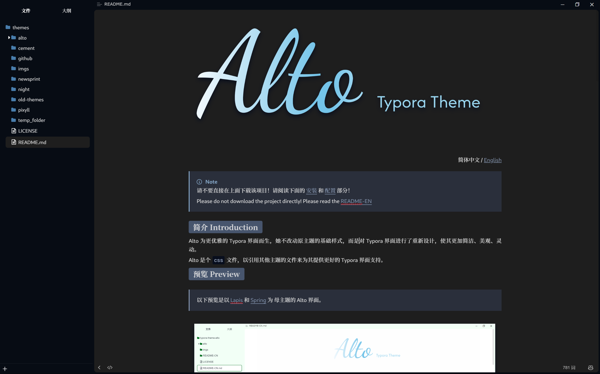

> [!NOTE]
> Please do not download the project directly! Please read the [Installation](#installation) and [Configuration](#configuration) sections below!

## Introduction

Alto is designed for a more elegant Typora interface. It doesn't alter the basic style of the original theme but redesigns the Typora interface to make it more concise, beautiful, and dynamic.

Alto is a `css` file that references other theme files to provide better Typora interface support.

It is recommended to use the Alto theme in the **Unibody** window style.

## Preview

> The following preview showcases the Alto interface based on the [Lapis](https://github.com/YiNNx/typora-theme-lapis) and [Spring](https://github.com/SprInec/typora-spring-theme) themes.








## Installation

The main file of this project is `alto.css`. The built-in themes in the above previews are [Lapis](https://github.com/YiNNx/typora-theme-lapis) (by [YiNNx](https://github.com/YiNNx)) and [Spring](https://github.com/SprInec/typora-spring-theme) (by [SprInec](https://github.com/SprInec)). They are included as submodules in the `alto` folder. So if you download the zip file of this project directly, these submodules will not be downloaded together. You need to download them separately or use the method provided below.

1. Method 1: Clone this project and its submodules [Recommended]
   1. Make sure you have Git installed.
   
   2. Open a terminal in Typora's theme folder and enter the following command:
   
      ```powershell
      git clone --recurse-submodules https://github.com/Seeridia/typora-theme-alto.git temp_folder
      
      Get-ChildItem -Path 'temp_folder' -Force | ForEach-Object {
          $destination = Join-Path -Path '.' -ChildPath $_.Name
          if (Test-Path $destination) {
              Remove-Item -Path $destination -Recurse -Force
          }
          Move-Item -Path $_.FullName -Destination '.' -Force
      }
      
      Remove-Item -Path 'temp_folder' -Recurse -Force
      ```
   
2. Method 2: Download the zip file from the project's [releases](https://github.com/Seeridia/typora-theme-alto/releases) and extract it into Typora's theme folder.
   
   The packaged files in the [releases](https://github.com/Seeridia/typora-theme-alto/releases) usually include [Lapis](https://github.com/YiNNx/typora-theme-lapis) and [Spring](https://github.com/SprInec/typora-spring-theme).

## Configuration

> Optional operation, defaulting to the Lapis theme and blue color scheme (Light mode)

1. In `Preferences > Appearance > Window Style`, set to "Unibody" mode and close Typora.

2. Open the `alto.css` file.

3. Configure Alto:

   1. `@import "alto/lapis/lapis.css";`  Configure the theme

      - For Lapis and Spring, the default location is `alto/xxx/xxx.css`.
      - For Typora themes or other downloaded themes, the location is `xxx.css`.

   2. `:root` Configure colors

      - There are currently several recommended color schemes in the comments of `alto.css`. You can choose according to your preference or add more colors. Contributions to the color scheme are welcome!
      
      - For [Lapis](https://github.com/YiNNx/typora-theme-lapis) and [Spring](https://github.com/SprInec/typora-spring-theme), the following color recommendations are provided:

        ```css
        /* Blue: Lapis */
        --alto-accent-color: #487dac;
        --alto-main-color: #e8f4ff;
        
        /* Green: Spring */
        --alto-accent-color: #077123;
        --alto-main-color: #f2fff6;
        ```

4. Enjoy Alto!

## Notes

- Give me a star 🌟!
- If you like the original themes, please also give them a star 🌟.
- The default configuration is for the Lapis theme with a blue color scheme. You can customize it according to your preference. (Again, directly downloading the project's zip file does not automatically download the Lapis and Spring themes; you need to download them separately.)
- For other third-party themes, please download and replace the code yourself. It may not fully support all themes, but most should work. Please test it yourself. You can also submit an [issue](https://github.com/Seeridia/typora-theme-alto/issues) to request support or initiate a [PR](https://github.com/Seeridia/typora-theme-alto/pulls) to contribute code.
- Thanks to [YiNNx](https://github.com/YiNNx) and [SprInec](https://github.com/SprInec) for their themes, their aesthetics inspired Alto.


