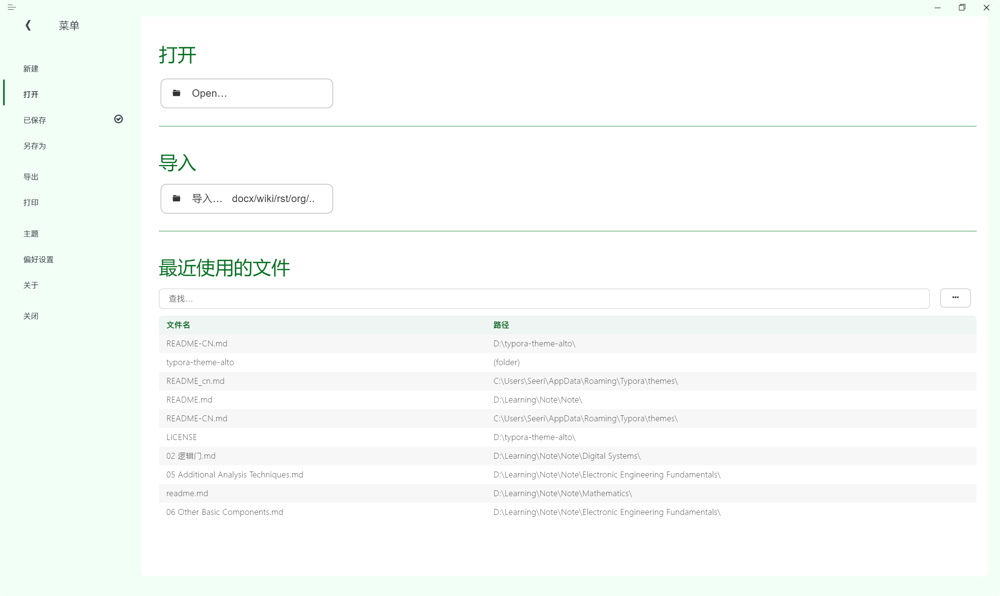
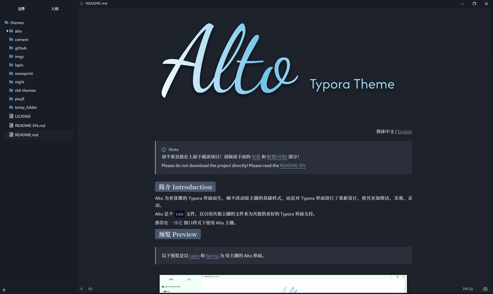

<p align="right">
	简体中文 / 
	<a href="https://github.com/Seeridia/typora-theme-alto/blob/main/README-EN.md">
    English
	</a>
</p>

> [!NOTE]
> 请不要直接在上面下载该项目！请阅读下面的 [安装](#安装-installation) 和 [配置(可选)](#配置-configuration) 部分！ 
>
> Please do not download the project directly! Please read the [README-EN](README-EN.md)

## 简介 Introduction

Alto 为更优雅的 Typora 界面而生，她不改动原主题的基础样式，而是对 Typora 界面进行了重新设计，使其更加简洁、美观、灵动。

Alto 是个 `css` 文件，以引用其他主题的文件来为其提供更好的 Typora 界面支持。

推荐在 **一体化** 窗口样式下使用 Alto 主题。

## 预览 Preview

> 以下预览是以 [Lapis](https://github.com/YiNNx/typora-theme-lapis) 和 [Spring](https://github.com/SprInec/typora-spring-theme) 为 母主题的 Alto 界面。







## 安装 Installation

该项目主体是 `alto.css` ，上面的预览所内置的主题是 [Lapis](https://github.com/YiNNx/typora-theme-lapis) ( [YiNNx](https://github.com/YiNNx) ) 和 [Spring](https://github.com/SprInec/typora-spring-theme) ( [SprInec](https://github.com/SprInec) ) ，他们以子模块的形式放在了文件夹 `alto` 中，所以如果你直接下载的该项目的 zip 文件，这两个模块并不会一起下载下来，你需要单独下载，或者采用我下面给出的方式。

1. 方式一：克隆该项目及其子模块
   1. 确保你安装了 Git 。
   
   2. 在 typora 主题文件夹 中打开终端，输入以下命令：
   
      ```powershell
      git clone --recurse-submodules https://github.com/Seeridia/typora-theme-alto.git temp_folder
      
      Get-ChildItem -Path 'temp_folder' -Force | ForEach-Object {
          $destination = Join-Path -Path '.' -ChildPath $_.Name
          if (Test-Path $destination) {
              Remove-Item -Path $destination -Recurse -Force
          }
          Move-Item -Path $_.FullName -Destination '.' -Force
      }
      
      Remove-Item -Path 'temp_folder' -Recurse -Force
      ```
   
2. 方式二：从该项目的 [releases](https://github.com/Seeridia/typora-theme-alto/releases) 下载 zip 文件，然后解压到 Typora 的主题文件夹中
   
   [releases](https://github.com/Seeridia/typora-theme-alto/releases) 里的打包好的文件一般会包含 [Lapis](https://github.com/YiNNx/typora-theme-lapis) 和 [Spring](https://github.com/SprInec/typora-spring-theme)

## 配置 Configuration

> 可选操作，默认为 Lapis 主题和蓝色配色（Light 模式）

1. 在 `偏好设置 > 外观 > 窗口样式` 改为 “一体化” 样式，关闭 Typora

2. 打开文件 `alto.css`

3. 配置 Alto

   1. `@import "alto/lapis/lapis.css";`  配置主题

      - 对 Lapis 和 Spring ，默认位置为 `alto/xxx/xxx.css` 
      - 对 Typora 主题 或其他你已经下载好的主题，位置为 `xxx.css`

   2. `:root`  配置颜色

      - 目前有几组推荐颜色，已经放在 `alto.css` 的注释中，你可以根据自己的喜好选择，也可以自己添加更多颜色，更欢迎你为配色贡献代码！

      - 而对于 [Lapis](https://github.com/YiNNx/typora-theme-lapis) 和 [Spring](https://github.com/SprInec/typora-spring-theme) 给出了以下颜色推荐

        ```css
        /* Blue 蓝 : Lapis */
        --alto-accent-color: #487dac;
        --alto-main-color: #e8f4ff;
        
        /* Green 绿 : Spring */
        --alto-accent-color: #077123;
        --alto-main-color: #f2fff6;
        ```

4. Enjoy Alto!

## 说明 Notes

- 给我个 star🌟 呗！
- 如果你喜欢原主题，也希望能回去给他们一个  star🌟 
- 其他第三方主题请自行下载替换代码，不一定能完全适配，不过大部分都可以了，请自行测试。也可以提交 [issue](https://github.com/Seeridia/typora-theme-alto/issues) 请求适配，或者发起 [PR](https://github.com/Seeridia/typora-theme-alto/pulls) 贡献代码。
- 感谢 [YiNNx](https://github.com/YiNNx) 和 [SprInec](https://github.com/SprInec) 的主题，他们为 Alto 提供了母版。


