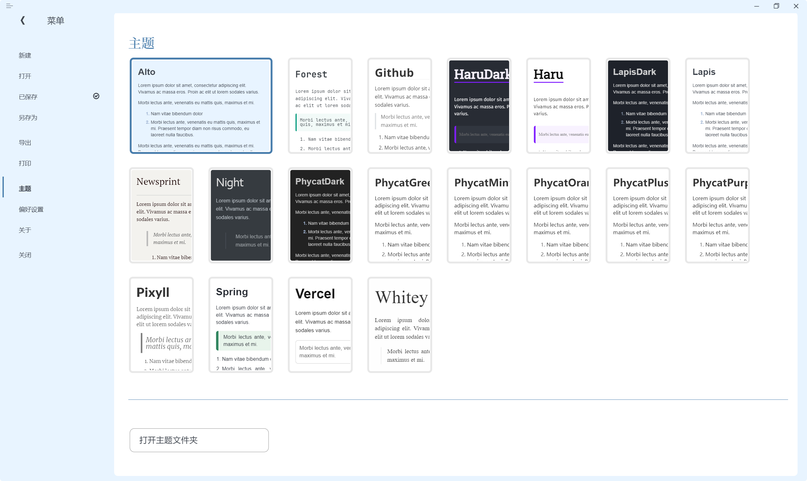

> [!NOTE]
> 请不要直接在上面下载该项目！请阅读下面的 [安装](## 安装 Installation) 和 [配置](## 配置 Configuration) 部分！

## 简介 Introduction

Alto 为更优雅的 Typora 界面而生，她不改动原主题的基础样式，而是对 Typora 界面进行了重新设计，使其更加简洁、美观、灵动。

> [!NOTE]
> 请在 “**一体化**” 界面下，使用 Alto

## 预览 Preview




## 安装 Installation

该项目主体是 `alto.css` ，上面的预览所内置的主题是 [YiNNx](https://github.com/YiNNx) 的 [Lapis](https://github.com/YiNNx/typora-theme-lapis) 和 [SprInec](https://github.com/SprInec) 的 [Spring](https://github.com/SprInec/typora-spring-theme) ，他们以子模块的形式放在了文件夹 `alto` 中，所以如果你直接下载的该项目的 zip 文件，这两个模块并不会一起下载下来，你需要单独下载，或者采用我下面给出的方式。

1. 方式一：克隆该项目及其子模块【推荐】
   1. 确保你安装了 Git 。
   
   2. 在 Typora 的主题文件夹中打开终端，输入以下命令：
   
      ```
      git clone --recurse-submodules https://github.com/Seeridia/typora-theme-alto.git .
      ```
   
2. 方式二：从该项目的 [releases](https://github.com/Seeridia/typora-theme-alto/releases) 下载 zip 文件，然后解压到 Typora 的主题文件夹中
   
   [releases](https://github.com/Seeridia/typora-theme-alto/releases) 里的打包好的文件一般会包含 [Lapis](https://github.com/YiNNx/typora-theme-lapis) 和 [Spring](https://github.com/SprInec/typora-spring-theme)

## 配置 Configuration

1. 在 `偏好设置 > 外观 > 窗口样式` 为 “一体化” 模式，关闭 Typora

2. 打开文件 `alto.css`

3. 配置 Alto

   1. `@import "alto/lapis/lapis.css";`  配置主题
   
      - 对 Lapis 和 Spring ，默认位置为 `alto/xxx/xxx.css` 
      - 对 Typora 主题 或其他你已经下载好的主题，位置为 `xxx.css`
   
   2. `:root`  配置颜色
   
      - 目前有几组推荐颜色，已经放在 `alto.css` 的注释中，你可以根据自己的喜好选择，也可以自己添加更多颜色，更欢迎你为配色贡献代码！
   
      - 而对于 [Lapis](https://github.com/YiNNx/typora-theme-lapis) 和 [Spring](https://github.com/SprInec/typora-spring-theme) 给出了以下颜色推荐
   
        ```css
        /* Blue 蓝 : Lapis */
        --alto-accent-color: #487dac;
        --alto-main-color: #e8f4ff;
        
        /* Green 绿 : Spring */
        --alto-accent-color: #077123;
        --alto-main-color: #f2fff6;
        ```
   
   3. Enjoy Alto!


